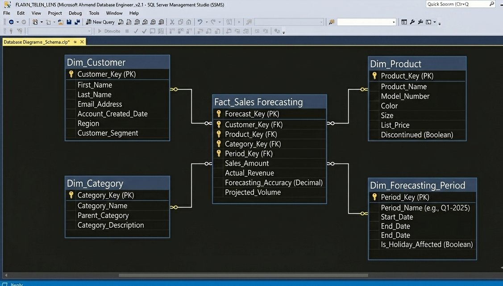
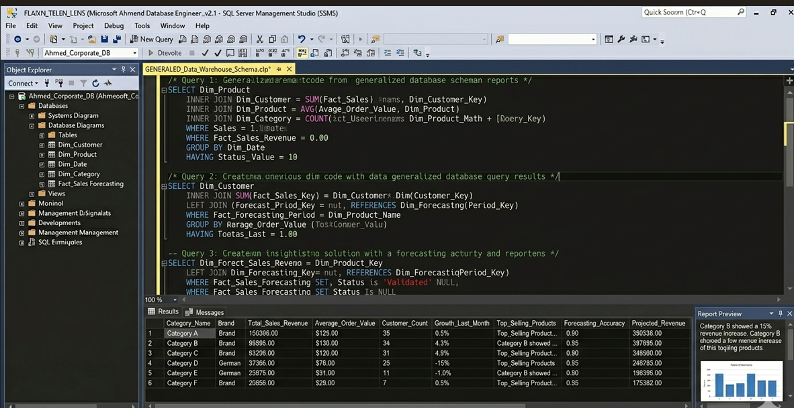

Sales Data Analysis and Insights
Overview
This project focuses on extracting actionable business insights from raw sales data using SQL. It includes complex queries designed to track revenue trends, identify top-performing products, and analyze customer purchasing behavior.

Analysis & Results

Key Analytical Skills
Trend Analysis: Calculating monthly revenue growth.

Product Intelligence: Identifying high-value inventory items.

Data Aggregation: Using advanced SQL functions (SUM, GROUP BY, TOP) to summarize business performance.
